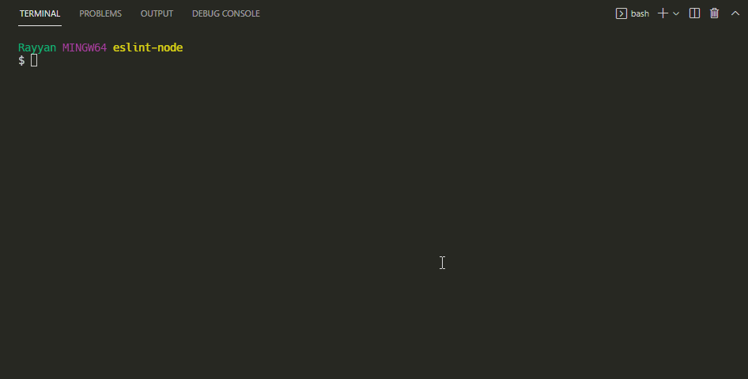

<!-- @format -->

# Eslint with Node Js

## Content

- [Install Eslint](#install-eslint)
- [Add Eslint](#add-eslint)
- [Extra Notes](#extra-notes)

<hr>

## Install Eslint

```shell
> npm install eslint --save-dev
            or
> yarn add eslint --dev
```

## Add Eslint

Let's generate our `.eslintrc.json` file!

Open you terminal on the project root folder and hit this command:

```shell
> npx eslint --init
          or
> yarn run eslint --init
```

This command with promote you to multiple options, choose them as following:

1. `To check syntax and find problems`
2. JavaScript modules > `commonjs`
3. Does your project use TypeScript No/Yes In my case, I am not using TypeScript > `No`
4. Where code run? > `Node`
5. What format of config file? > `JSON`
6. Would you like to install them now with npm? > `Yes`




After finishing this promote options, an `eslintrc.json` file will be created with the following configuration:

```json
{
  "env": {
    "browser": true,
    "commonjs": true,
    "es2021": true
  },
  "extends": "eslint:recommended",
  "parserOptions": {
    "ecmaVersion": 12
  },
  "rules": {}
}
```

We will add additional eslint rules to this file. So you can override the entire content of this file with the following:

```json
{
  "env": {
    "node": true,
    "commonjs": true,
    "es2021": true,
    "jest": true
  },
  "extends": "eslint:recommended",
  "parserOptions": {
    "ecmaVersion": 12
  },
  "rules": {
    "no-console": "warn",

    //* Avoid Bugs
    "no-undef": "error",
    "semi": "error",
    "semi-spacing": "error",

    //* Best Practices
    "eqeqeq": "warn",
    "no-invalid-this": "error",
    "no-return-assign": "error",
    "no-unused-expressions": ["error", { "allowTernary": true }],
    "no-useless-concat": "error",
    "no-useless-return": "error",
    "no-constant-condition": "warn",
    "no-unused-vars": ["warn", { "argsIgnorePattern": "req|res|next|__" }],

    //* Enhance Readability
    "indent": ["error", 2, { "SwitchCase": 1 }],
    "no-mixed-spaces-and-tabs": "warn",
    "space-before-blocks": "error",
    "space-in-parens": "error",
    "space-infix-ops": "error",
    "space-unary-ops": "error",
    "quotes": ["error", "single"],
    //
    "max-len": ["error", { "code": 200 }],
    "max-lines": ["error", { "max": 500 }],
    "keyword-spacing": "error",
    "multiline-ternary": ["error", "never"],
    "no-mixed-operators": "error",
    //
    "no-multiple-empty-lines": ["error", { "max": 2, "maxEOF": 1 }],
    "no-whitespace-before-property": "error",
    "nonblock-statement-body-position": "error",
    "object-property-newline": [
      "error",
      { "allowAllPropertiesOnSameLine": true }
    ],

    //* ES6
    "arrow-spacing": "error",
    "no-confusing-arrow": "error",
    "no-duplicate-imports": "error",
    "no-var": "error",
    "object-shorthand": "off",
    "prefer-const": "error",
    "prefer-template": "warn"
  }
}
```

So what is hell we just added? 🤷‍♀️

**Calm down bud!**

we just added `"jest": true` to `env`, in case you want to apply **unit testing** to your project. Also we added extra rules to the `rules` section. **Aaand that's it. 😅**

## Extra Notes
**Why these certain rules?!**

Honestly there are a lot lot other rules that you can add, theses rules are quite enough to enhance your code readability and help you avoid bugs. ***Faire enough!!*** 🙂

> *One more thing, you can **change** any of the previous RULES to make them meet your need.*

***Happy Eslint 🎉🎉✨***
